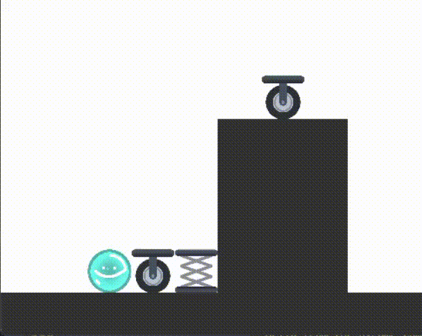
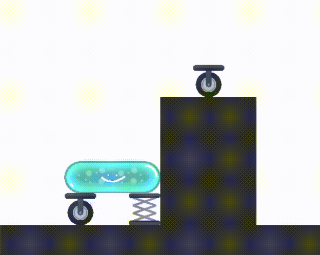
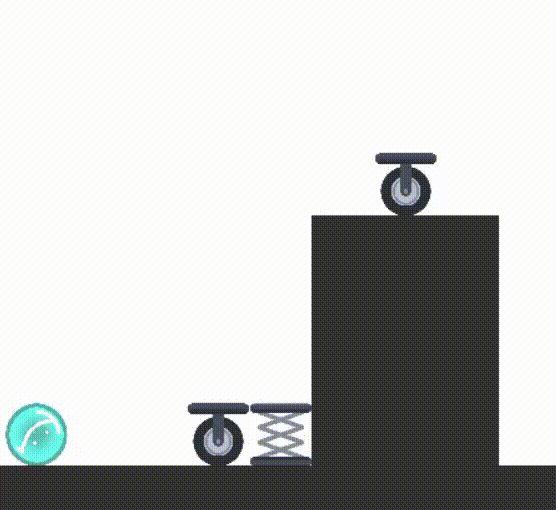

# Lord-pikpik-le-sorcier 

## Serez-vous capable de passer au travers de tous les niveaux qui testerons vos capacité et votre compréhensions des différentes mécaniques qui vous sont offertes?

---

# Jeu
## Règles :
Afin de passer de niveaux en niveaux vous disposez de la capacité : transformation corporelle. Des items seront également mis à disposition afin de vous aider, ou pas.

---

##Commandes :

### E :  Ouverture / Fermeture de l'interface de craft
  

### R : Recommancer le niveau 
  

### Flèches : Se déplacer
  

### Espace : Sauter
  

---

### Indications quant à l'interface de craft :

- Changer de forme corporelle:
        Un fois la table de carft ouvert vous aurez accès à un pinceau et une gomme. Le pinceaux permet de prolonger votre perosnnage et la gomme le retrécir .
     
- Ajouter des items :
    Une fois l'item récolter, il ne vous reste plus qu'à le faire glisser sur vous.
    Attention: vous ne pouvez pas plavcer les objets n'importe comment.

- Remarque : Vous n'êtes pas obligé de prendre des objets, certains seront la pour vous aider et d'autres non.

---
      
## Installation:
Pour jouer, il est recommandé d'utiliser au minimumune version de python 3.X, afin d'avoir acces à toutes les librairies.

1. Installer pygame
2. ouvrir le fichier ./Scrpits/main.py

## Crédits
STOLL Vetea
FAUCON Chloé
